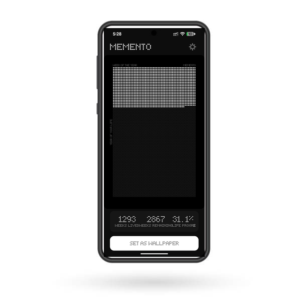

<h1 align="center">Memento</h1>

<p align="center">
  A minimalist Android launcher that replaces your home screen with a life calendar — a dot-matrix grid showing every week of your life, lived and remaining.
</p>

<p align="center">
  
  &nbsp;&nbsp;&nbsp;&nbsp;
  
</p>

<p align="center">
  <a href="https://github.com/dharmveerjakhar/memento/releases"></a>
  <a href="LICENSE"></a>
  
</p>

## Why

Inspired by [Wait But Why's "Your Life in Weeks"](https://waitbutwhy.com/2014/05/life-weeks.html) and [The Life Calendar](https://thelifecalendar.com/). The premise is simple: if you can see how many weeks you've used and how many remain, you'll think twice before wasting one.

Memento turns that idea into your daily interface. No widgets, no wallpaper apps — it *is* the launcher.

## Features

**Launcher**
- Three-page layout: Life Calendar | Home | App Drawer
- Dot-matrix clock with date, screen time, and next alarm
- Pinned favorite apps on home screen, two configurable dock corners
- Birthday detection with animated greeting

**App Drawer**
- Alphabetical grouping with side scrubber for quick navigation
- Search with prefix-match prioritization
- Custom folders, app renaming, app hiding
- Long-press context menus for all actions

**Life Calendar**
- Each dot = one week. Filled = lived, empty = remaining.
- Four dot styles (circle, ring, square, diamond), dark/light themes
- Auto-updates weekly via WorkManager
- Applies to home screen, lock screen, or both

**Focus Tools**
- Mark apps as "distracting" — triggers a configurable mindful delay before launch
- Usage nudge: after N continuous minutes in a distracting app, interrupts with a reminder
- Screen time display on home screen (requires usage access permission)

**Customization**
- Clock formats: 24h, 12h, 24h with seconds
- Font scaling: small, medium, large
- Background: solid black (OLED-friendly) or matrix dot grid
- Search bar position: top or bottom
- Full backup/restore of all settings to JSON

## Getting Started

### Install from Release

1. Download the latest APK from [Releases](https://github.com/dharmveerjakhar/memento/releases).
2. Install on your Android device (requires "Install from Unknown Sources" enabled).
3. Follow the three-step setup: birth date, default launcher, wallpaper.

### Build from Source

Requires JDK 17 and Android SDK 35.

```bash
git clone https://github.com/dharmveerjakhar/memento.git
cd memento
./gradlew assembleDebug
./gradlew installDebug
```

## Architecture

MVVM with Jetpack Compose. Three layers under `app/src/main/java/com/optimistswe/mementolauncher/`:

```
data/          Repositories backed by DataStore (preferences, favorites, labels, folders)
domain/        Pure business logic (life calendar math)
generator/     Canvas-based wallpaper image generation
ui/            Compose screens, components, ViewModels, theme
  managers/    Clock and widget state management
  screens/     Home, app drawer, wallpaper, settings
  components/  Dot-matrix text/icon renderers, dialogs, overlays
worker/        WorkManager periodic wallpaper refresh
service/       Accessibility service for usage nudges
di/            Hilt dependency injection module
```

State flows from repositories through ViewModels to Compose via `StateFlow` and `collectAsState()`. No LiveData.

## Permissions

| Permission | Purpose | Grant type |
|---|---|---|
| `SET_WALLPAPER` | Apply life calendar wallpaper | Auto-granted |
| `EXPAND_STATUS_BAR` | Swipe-down to open notifications | Auto-granted |
| `REQUEST_DELETE_PACKAGES` | Uninstall apps from context menu | Auto-granted |
| `PACKAGE_USAGE_STATS` | Screen time display on home screen | Manual (Settings) |
| Accessibility Service | Usage nudge for distracting apps | Manual (Settings) |

## Contributing

See [CONTRIBUTING.md](CONTRIBUTING.md) for setup instructions, code style, and PR guidelines.

## License

MIT. See [LICENSE](LICENSE).

Built on ideas from [Wait But Why](https://waitbutwhy.com/), [The Life Calendar](https://thelifecalendar.com/), and [@luismbat](https://x.com/luismbat).
